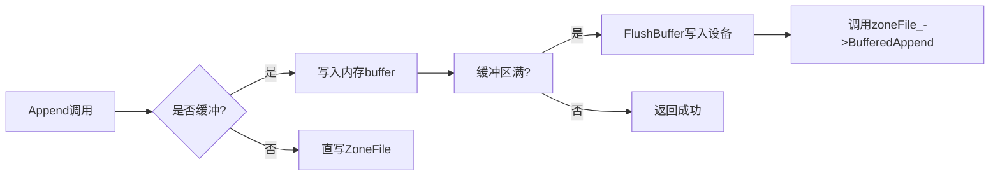
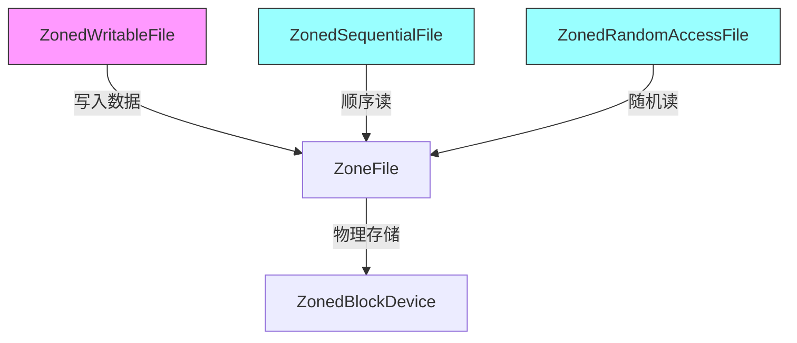

# 说明

参考论文：[ZNS: Avoiding the Block Interface Tax for Flash-based SSDs](https://www.usenix.org/conference/atc21/presentation/bjorling)

源代码：[ZenFS-github](https://github.com/westerndigitalcorporation/zenfs)

# 代码

github的构建流程中，有一步是“Build the zenfs utility”，这里的utility一般指辅助主系统的小程序，比如可能是辅助命令行工具，用来操作zenfs，比如格式化、挂载、调试、状态查询等，具体要看util文件夹下的代码了，核心是zenfs.cc。这个步骤的编译会产生名为zenfs的程序，后续测试时就需要使用到。

> 注意，.cc文件和.cpp文件没有本质区别。

事实上这个zenfs.cc也是我们分析zenfs代码的不错的切入点。

## zenfs.cc

main函数里面，首先分析`mkfs`(make file system)操作，就是建立文件系统，函数名称是`zenfs_tool_mkfs`。

mkfs函数内，`zbd_open`函数涉及到一个class: `ZonedBlockDevice`，位于zenfs的fs文件夹下的zbd_zenfs.h中，包含分区块设备的一些属性和函数。

`zbd_open`会将用户运行zenfs程序时传入的设备路径作为参数，调用zbd_zenfs.cc中的`ZonedBlockDevice`的一个构造函数。

在这个构造函数中，会根据设备路径构造一个`ZbdlibBackend`对象，其在zbdlib_zenfs.cc被定义，这里构造时用初始化列表来进行初始化并给传入的设备名称加了个`/dev`。

这个`ZbdlibBackend`类怎么理解？

在`ZonedBlockDevice`类中就有一个指向`ZonedBlockDeviceBackend`派生类对象的智能指针`zbd_be_`，事实上这个`ZonedBlockDeviceBackend`类是纯虚基类（interface），其作用是定义所有子类必须实现的一些操作，也就是后续的`ZbdlibBackend`类需要实现的一些操作。

实际运行时这个`zbd_be_`通常指向一个`ZbdlibBackend`实例。然后zbd对象可以通过调用`zbd_be_`后端接口实现自己的业务逻辑，比如zone分配、资源管理、并发同步等.

`ZonedBlockDevice`作为对外提供的类，主要完成高层业务逻辑。

具体底层细节交由 `ZonedBlockDeviceBackend`接口和其子类 `ZbdlibBackend` 实现。

> 这样的设计是典型的面向接口编程，实现了良好的模块分离和扩展性——将底层设备访问抽象出来，今后可以替换成其他后端实现而不影响上层代码。

回到mkfs，调用zbd_open主要是构造zbd的后端然后检查zbd是否可以打开。

没问题的话，会创建一个ZenFS类的对象zenFS，并检查是否已经挂载，调用zenfs.cc中的`zenfs_mount`函数。

> **挂载（mount）** 是操作系统中的一个概念，指**将一个文件系统连接到操作系统的目录树上，使用户可以通过目录访问该文件系统中的文件和目录。**

关于这个ZenFS类需要说明一下。其位于fs文件夹下的fs_zenfs.h中，继承自公共类`FileSystemWrapper`。内容很多，一个类有300多行。

其中比较重要的是包含了`ZonedBlockDevice`对象指针`zbd_`，可以通过zbd_访问到分区块设备的各种信息以及后端接口`zbd_be_`。

此外有很多文件系统相关的属性和方法。

回到检查是否已经挂载的部分，这部分的操作是先创建一个ZenFS对象指针，调用`zenfs_mount`函数获取一个状态s，根据s判断是否已经挂载。

如果已经挂载则不进行后续的mkfs操作。

zenfs程序的大部分操作都会进行这个挂载检查。不过只有mkfs是期望未挂载，其他操作都是期望已挂载。

我这里使用zbd，是`raw block device`，而非`zonefs`，根据ZenFS的github官方文档，不需要手动进行挂载的操作。

确实我是无法自己通过文件系统访问ZNS设备内部文件的，或许如果使用zonefs就可以了，不过这在测试阶段也没什么实际意义。


`zenfs_tool_mkfs`函数内确认未挂载并将zbd信息传入zenFS对象后，会调用zenFS的MKFS方法进行真正的mkfs。

MKFS里面，首先会获取并初始化zbd的每一个zone。然后会初始化日志，初始化超级块等。然后就没什么了。


zenfs.cc的main还有其他操作，就不说了，总之这个文件以及对应的zenfs程序都是针对后端的，为用户提供了后端接口，而实际场景下其他应用程序是通过前端来访问ZNS SSD，就和这部分没什么关系了。就要看ZenFS的其他文件了，比如io_zenfs。

## io_zenfs.h io_zenfs.cc

io_zenfs.h中有几个类需要说明：

### 1. ZoneExtent：数据段物理映射

#### 核心功能

- 物理存储映射：表示文件在Zoned Block Device上的一段连续物理存储区域
- 关键成员：
  ```cpp
  uint64_t start_;   // 在Zone中的起始偏移(字节)
  uint64_t length_;  // 数据段长度(字节)
  Zone* zone_;       // 所属Zone的指针
  ```
- 持久化能：
  - `EncodeTo()`：序列化到字符串（用于日志记录）
  - `DecodeFrom()`：从Slice反序列化（用于崩溃恢复）

#### 在ZenFS中的角色
- 相当于文件的"物理存储碎片"，一个文件由多个`ZoneExtent`组成
- 不可跨Zone：每个`ZoneExtent`完全属于一个Zone（符合ZNS顺序写约束）

### 2. ZoneFile：文件实体核心类

#### 核心功能

- 文件物理表示：管理文件在ZNS设备上的存储结构和元数据
- 关键状态管理：
  
  ```cpp
  std::vector<ZoneExtent*> extents_;  // 文件的所有数据段
  Zone* active_zone_;                 // 当前写入的Zone
  Env::WriteLifeTimeHint lifetime_;   // RocksDB提供的生命周期提示
  uint64_t file_size_;                // 文件逻辑大小
  ```

#### 核心能力矩阵
| 功能类别         | 关键方法                                                 | 说明                               |
| ---------------- | -------------------------------------------------------- | ---------------------------------- |
| **写入控制**     | `Append()`, `BufferedAppend()`, `SparseAppend()`         | 支持三种写入模式（直接/缓冲/稀疏） |
| **元数据持久化** | `PersistMetadata()` → 调用`metadata_writer_->Persist()`  | 依赖MetadataWriter实现实际存储     |
| **空间管理**     | `AllocateNewZone()`, `PushExtent()`, `CloseActiveZone()` | 管理Zone分配和Extent创建           |
| **并发控制**     | `AcquireWRLock()`, `ReadLock`, `WriteLock`               | 通过读写锁保证线程安全             |
| **崩溃恢复**     | `Recover()`, `MetadataSynced()`, `DecodeFrom()`          | 通过日志重放恢复文件状态           |
| **数据迁移**     | `MigrateData()`                                          | 实现Zone间的数据移动（用于GC）     |

`ZoneFile`可通过`extents_`属性管理`ZoneExtent`。

`ZoneFile`通过`active_zone_`管理当前写入位置.

**区别对比**

| 特性           | ZoneExtent            | ZoneFile                          |
| -------------- | --------------------- | --------------------------------- |
| **本质**       | 数据物理映射描述符    | 文件实体管理器                    |
| **生命周期**   | 随文件数据块创建/销毁 | 从文件打开到关闭                  |
| **线程安全**   | 由ZoneFile保护        | 内置读写锁机制                    |
| **持久化责任** | 被序列化存储（被动）  | 组织待存储数据                    |
| **典型数量**   | 每个文件数十至数百个  | 每个打开文件1个                   |
| **关键操作**   | 无自主行为            | Append()/Read()/PersistMetadata() |

### 3. ZonedWritableFile: 写入操作核心

#### 类继承与定位
```cpp
class ZonedWritableFile : public FSWritableFile
```
- 角色：RocksDB **可写文件**的ZenFS实现，处理所有写入操作
- 设计目标：适配ZNS设备的顺序写约束，提供缓冲/直写双模式

#### 核心能力与成员
| 特性 | 成员/方法 | 功能说明 |
|------|-----------|----------|
| **底层文件** | `shared_ptr<ZoneFile> zoneFile_` | 关联的物理文件对象 |
| **双模式写入** | `bool buffered` | true=缓冲写入(WAL), false=直写(SST) |
| **缓冲区管理** | `char* buffer`, `buffer_pos` | 缓冲模式下的内存缓存区 |
| **稀疏写入** | `char* sparse_buffer` | 处理非对齐写入（见`SparseAppend`）|
| **写入位置** | `uint64_t wp` | 当前文件写指针位置 |
| **元数据持久化** | `MetadataWriter* metadata_writer_` | 委托元数据存储 |

#### 关键方法

```cpp
// 核心写入方法（实现RocksDB接口）
IOStatus Append(const Slice& data) override {
  if (buffered) return BufferedWrite(data);
  else return zoneFile_->Append(data.data(), data.size());
}

// 缓冲写入实现
IOStatus BufferedWrite(const Slice& data) {
  std::lock_guard<std::mutex> lock(buffer_mtx_);
  // 复制数据到缓冲区
  if (buffer_pos + data.size() > buffer_sz) {
    IOStatus s = FlushBuffer(); // 缓冲区满时刷盘
  }
  // ... 数据复制到buffer
  return IOStatus::OK();
}

// 同步机制
IOStatus Sync() override {
  if (buffered) FlushBuffer();
  return zoneFile_->PersistMetadata(); // 持久化元数据
}
```

#### 工作流特点



### 2. ZonedSequentialFile：顺序读取

#### 类继承与定位
```cpp
class ZonedSequentialFile : public FSSequentialFile
```
- 角色：实现 **顺序访问** 读取（如WAL日志顺序扫描）
- 典型场景：RocksDB的Compaction过程/日志重放

#### 核心特性
| 特性 | 成员/方法 | 功能说明 |
|------|-----------|----------|
| **文件关联** | `shared_ptr<ZoneFile> zoneFile_` | 被读取的物理文件 |
| **读指针** | `uint64_t rp` | 当前读取位置 |
| **I/O模式** | `bool direct_` | 直读控制（跳过页缓存） |

#### 关键方法
```cpp
// 顺序读取实现
IOStatus Read(size_t n, Slice* result, char* scratch) override {
  // 委托给底层文件对象
  IOStatus s = zoneFile_->PositionedRead(rp, n, result, scratch, direct_);
  if (s.ok()) rp += result->size(); // 移动读指针
  return s;
}

// 跳跃读取
IOStatus Skip(uint64_t n) override {
  rp += n; // 仅移动指针不读数据
  return IOStatus::OK();
}
```

### 3. ZonedRandomAccessFile：随机读取
#### 类继承与定位
```cpp
class ZonedRandomAccessFile : public FSRandomAccessFile
```
- 角色：实现 **随机访问** 读取（如SST文件点查询）
- 典型场景：RocksDB的Get操作/范围查询

#### 核心特性

| 特性 | 成员/方法 | 功能说明 |
|------|-----------|----------|
| **文件关联** | `shared_ptr<ZoneFile> zoneFile_` | 被读取的物理文件 |
| **直读控制** | `bool direct_` | 与顺序读相同 |
| **无状态设计** | 无位置指针 | 每次读取指定offset |
| **预取空实现** | `Prefetch()` | 因ZNS特性无需实现 |

#### 关键方法

```cpp
// 随机读取核心
IOStatus Read(uint64_t offset, size_t n, Slice* result, char* scratch) const {
  // 直接委托给ZoneFile的定位读取
  return zoneFile_->PositionedRead(offset, n, result, scratch, direct_);
}
```

### 三者的协作关系



#### 共同点

1. **共享底层对象**：均持有 `shared_ptr<ZoneFile>`
2. **I/O模式统一**：通过 `direct_` 控制直读/直写
3. **块对齐要求**：`GetRequiredBufferAlignment()` 返回ZBD块大小
4. **缓存管理**：均支持 `InvalidateCache()`（委托给ZoneFile）

#### 核心差异

| 维度 | ZonedWritableFile | ZonedSequentialFile | ZonedRandomAccessFile |
|------|-------------------|---------------------|------------------------|
| **操作类型** | 写 | 顺序读 | 随机读 |
| **状态管理** | 维护写指针(wp) | 维护读指针(rp) | 无状态 |
| **缓冲机制** | 有缓冲区管理 | 无缓冲 | 无缓冲 |
| **并发控制** | 有buffer_mtx_锁 | 无锁 | 无锁 |
| **典型场景** | WAL/SST写入 | Compaction读取 | Point-Query读取 |
| **复杂度** | 高（需处理缓冲/刷盘/元数据） | 中 | 低 |

### 与底层ZoneFile的关键交互

#### 1. 写入路径

```cpp
// ZonedWritableFile 触发写入
zoneFile_->Append(data) 
  → ZoneFile::BufferedAppend() 
    → ZoneFile::PushExtent() // 创建新Extent
    → Zone::Append()         // 写入ZBD设备
```

#### 2. 读取路径

```cpp
// 顺序读/随机读最终调用
zoneFile_->PositionedRead(offset, n, ...)
  → ZoneFile::GetExtent()   // 定位数据段
  → Zone::Read()            // 从ZBD读取
```

#### 3. 元数据同步

```cpp
// Sync() 触发元数据持久化
ZonedWritableFile::Sync()
  → zoneFile_->PersistMetadata()
    → metadata_writer_->Persist() // 写入日志区
```

> **架构本质**：这三个类是 **RocksDB文件操作到ZNS设备的适配层**，将通用文件操作翻译为符合ZNS约束的zone顺序写操作，通过委托给`ZoneFile`实现物理存储管理。

# 修改

## 流程

假如我要修改zenfs，在里面添加一个printf，然后重新做YCSB的测试，是什么流程？

1. 自行修改zenfs代码并保存
2. 如果修改的是util文件夹下的代码，比如zenfs.cc的，那么直接在util文件夹make即可；反之，如果是fs文件夹，则需按zenfs文档步骤重新编译RocksDB
3. 