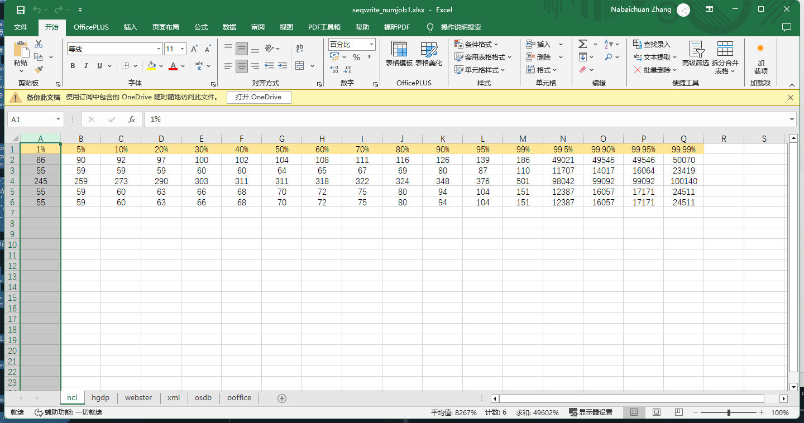
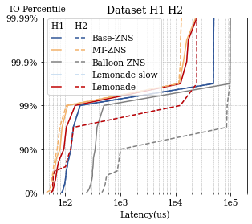

# 说明

使用anaconda环境：[Anaconda环境配置Python绘图库Matplotlib的方法_anaconda安装matplotlib-CSDN博客](https://blog.csdn.net/zhebushibiaoshifu/article/details/129305026)

matplotlib确实是画图神器，可以自己控制图像上的几乎所有元素而且很多情况下一行代码就可以完成一个设置。

一些我学习的网站：

- [matplotlib之pyplot模块之图例（legend）基础（legend()的调用方式，图例外观设置）_pyplot legend-CSDN博客](https://blog.csdn.net/mighty13/article/details/113820798)
- [matplotlib 中图例的标题位置设置（靠左，居中，靠右）_matlab 图例的怎么居中-CSDN博客](https://blog.csdn.net/lqv587ss/article/details/108182685)

展示一下我之前问gpt然后自己改动的一个画图代码：

```python
# -*- coding: utf-8 -*-
'''
测试需要自定义内容：
- describe 规定本地文件夹要有describe.xlsx。第一行是百分比，后面每行是一个方案的对应延迟，以us为单位
- group，num 如果要分组测就要修改group和num。这里默认是两个负载一组，共3组
- 其他图形显示方面的参数 自行设置，比如fig_width、xlim、colors、linestyles等。这里默认没有使用mark
'''
import pandas as pd
import matplotlib.pyplot as plt
import numpy as np

def custom_y(axis, val):
    """自定义y轴映射函数，强调0.9到0.9999的区域，使每个段显示一样宽度"""
    if val < 0.9:
        return val  # 原样显示0到0.9的部分
    elif val < 0.99:
        return 1 + (val - 0.9) * 10  # 拉伸0.9到0.99
    elif val < 0.999:
        return 2 + (val - 0.99) * 100  # 拉伸0.99到0.999
    elif val < 0.9999:
        return 3 + (val - 0.999) * 1000  # 拉伸0.999到0.9999
    else:
        return 4

# 设置中文显示
plt.rcParams['font.family'] = 'serif'
plt.rcParams['font.sans-serif'] = ['Times New Roman']
plt.rcParams['font.size'] = 10.5  # 设置字体大小
plt.rcParams['axes.unicode_minus'] = False

# 假设数据保存在同一个工作簿的不同工作表中
sheets = ['nci', 'hgdp', 'webster', 'xml', 'osdb', 'ooffice']
schemes = ['Base-ZNS', 'Ideal-ZNS', 'Balloon-ZNS', 'Lemonade-slow', 'Lemonade']
colors = ['#2F5597', '#F3B169', '#808080', '#BDD7EE', '#C00000']  # 颜色列表
linestyles = ['-', '--', '-', '--', '-', '--']  # 线型列表
markers = ['o', 's', 'D', '^', 'x']  # 标记列表

# 计算图形的宽度和高度
fig_width = 11.4 / 2.54
fig_height = 4

describe = 'randomread-numjob1' # 自行更改. 我规定这个要和文件名匹配，看下面的read_excel
datasets = ['H1', 'H2', 'M1', 'M2', 'L1', 'L2']
group = 2 # 0/1/2, 这里的需求是每两个负载为1组来显示，共显示3张图.对于seqwrite的第3组，建议把后面xlim的right改大到4e5
num = 2
drawing_flag = [0, 0, 0, 0, 0, 0]
drawing_id = [0, 0]
cnt = 0
for i in range(group * num, group * num + num):
    drawing_flag[i] = 1
    drawing_id[cnt] = i
    cnt += 1
    

# 创建图形
plt.figure(figsize=(fig_width, fig_height))

# 遍历每个负载
for i, sheet in enumerate(sheets):
    if drawing_flag[i] == 0:
        continue;
    # 读取数据
    data = pd.read_excel(describe + '.xlsx', sheet_name=sheet, header=None)

    # 第一行为百分比，后面的行为延迟数据
    percentiles = data.iloc[0].values
    delays = data.iloc[1:6].values  # 假设有5种方案

    # 绘制每种方案
    if i % 2 == 0:
        for j, scheme in enumerate(schemes):
            # 使用自定义的y映射函数
            transformed_percentiles = [custom_y(None, val) for val in percentiles]
            plt.plot(delays[j], transformed_percentiles, 
                     label=' ',  # 导入图例用的标签
                     color=colors[j],  # 使用方案的颜色
                     linestyle=linestyles[i])
    else:
        for j, scheme in enumerate(schemes):
            # 使用自定义的y映射函数
            transformed_percentiles = [custom_y(None, val) for val in percentiles]
            plt.plot(delays[j], transformed_percentiles, 
                     label=f'{scheme}',  # 导入图例用的标签
                     color=colors[j],  # 使用方案的颜色
                     linestyle=linestyles[i])

# 不均匀的纵坐标
y_ticks = [0, 0.9, 0.99, 0.999, 0.9999] # excel中如果是百分数，这里还是要写小数
y_labels = ['0%', '90%', '99%', '99.9%', '99.99%']

# 设置y轴范围
plt.ylim(0, 1)
plt.yticks(np.arange(len(y_ticks)), y_labels)  # 设置Y轴刻度和标签

plt.xscale('log')  # 使用对数坐标
plt.xticks([10, 1e2, 1e3, 1e4, 1e5], ['10', '1e2', '1e3', '1e4', '1e5'])  # 自定义x轴标签

# 缩短x轴的前后空白
if describe == 'seqwrite-numjob1':
    if group == 2:
        plt.xlim(left=40, right=4e5)  # 根据数据情况调整上下界
    else:
        plt.xlim(left=40, right=2e5)
else:
    plt.xlim(left=10, right=5e3) # 这是seqread的情况

# 设置坐标轴标签
plt.xlabel('Latency(us)')
plt.ylabel('IO Percentile',
           labelpad=-40,  #调整y轴标签与y轴的距离
           y=1.03,  #调整y轴标签的上下位置
           rotation=0
           )

# 添加图例
legend = plt.legend(
    title=datasets[drawing_id[0]] +'    '+ datasets[drawing_id[1]],
    # title_fontsize=9,
    # bbox_to_anchor=(0.3, 0.78), # 这是顺序写的位置
    bbox_to_anchor=(0.71, 0.23), # 这是顺序读和随机读
    loc='center', 
    ncol=2, 
    framealpha=0.8, 
    handlelength=1.2, 
    columnspacing=0.5
    # prop={'size': 9}    
)

legend._legend_box.align = "left" # 图例标题靠左

# 添加网格
plt.grid(which='both', linestyle='--', linewidth=0.5)

# 设置图像标题
plt.title('Dataset' + ' ' + datasets[drawing_id[0]] + ' ' + datasets[drawing_id[1]])

# 调整布局
plt.tight_layout()

# 保存图像,注意使用本地获得的图像而不是用show函数生成的图，后者会失真
plt.savefig('plot' + '-' + describe + '-'+ datasets[drawing_id[0]] + '-' + datasets[drawing_id[1]]+'.png', dpi=300)
plt.show()
```

输入文件我自己在输入前就规范了格式以方便处理，excel形式是这样的：



很复杂的图也画出来了，确实是能满足复杂要求：



熟悉代码就可以方便地做各种调整从而生成各种图片了。
